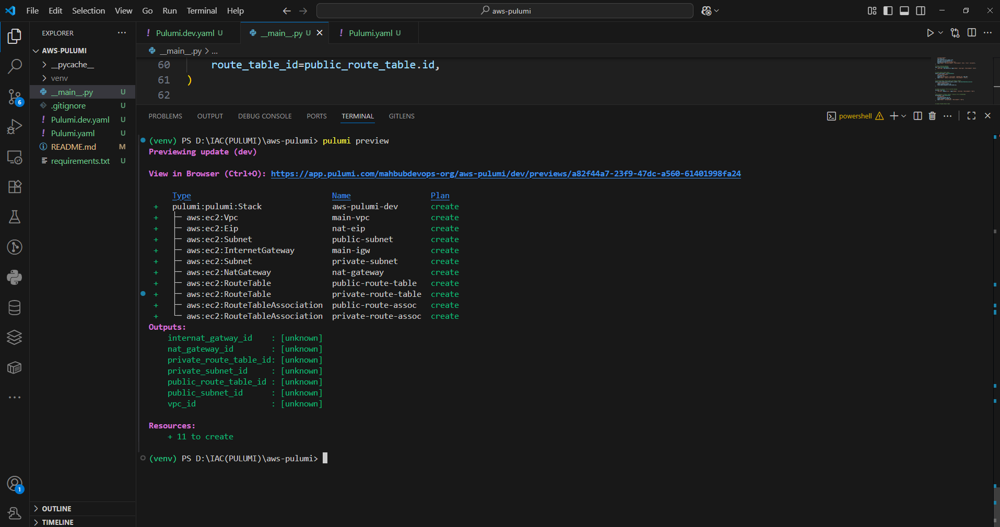
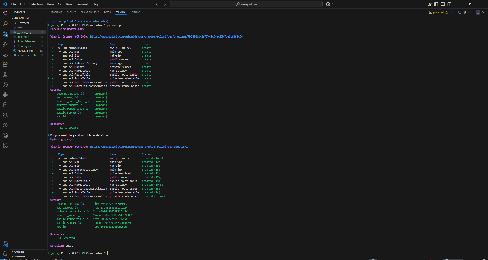
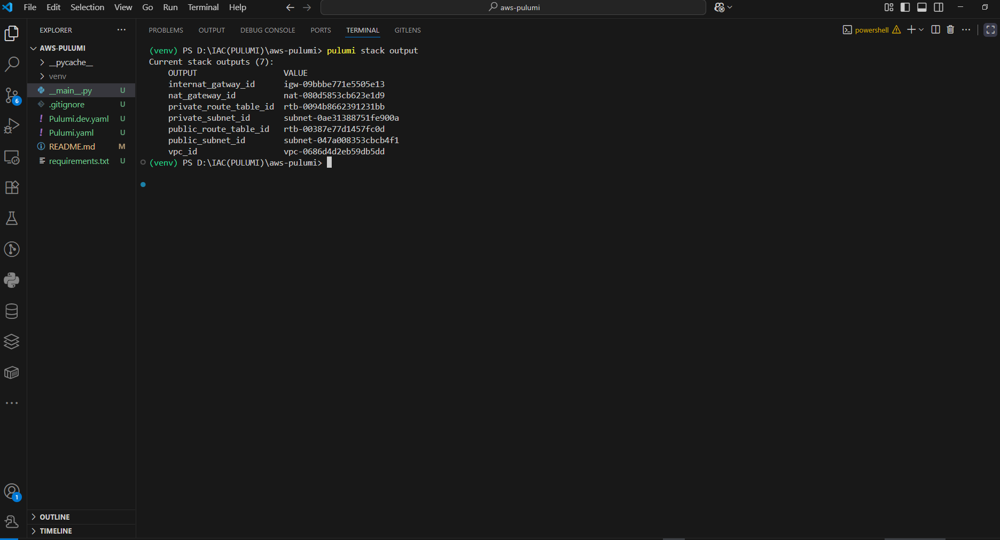
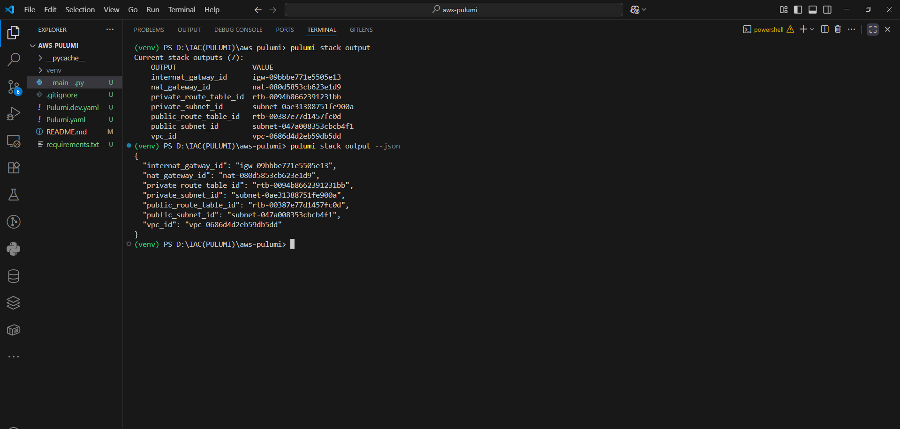
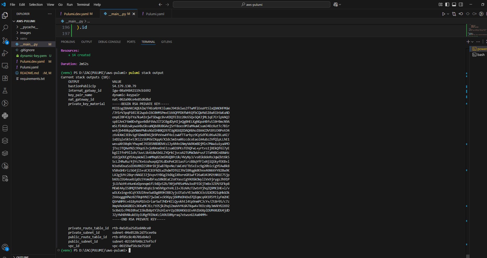
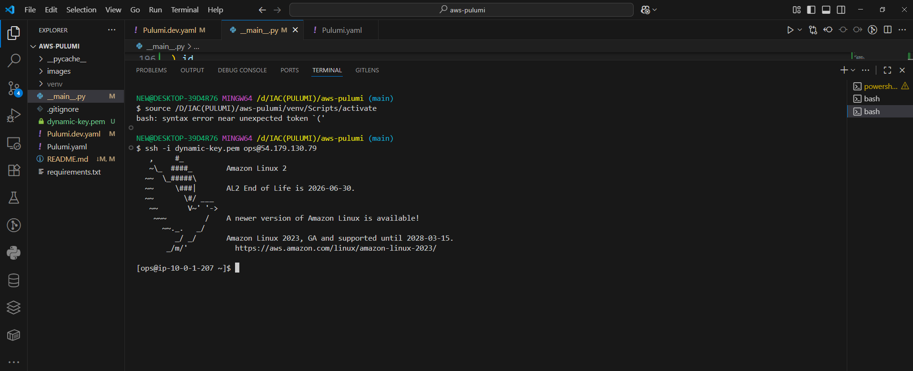
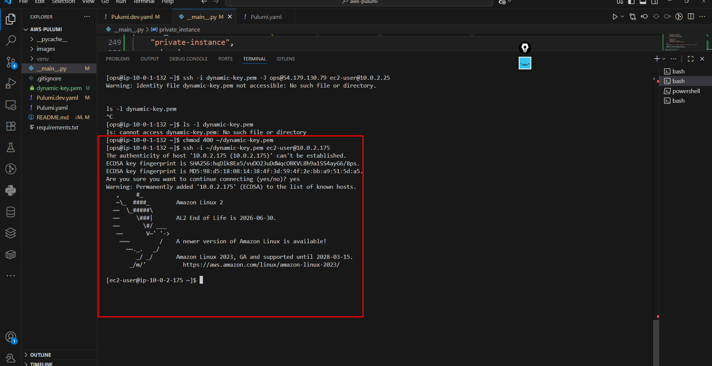
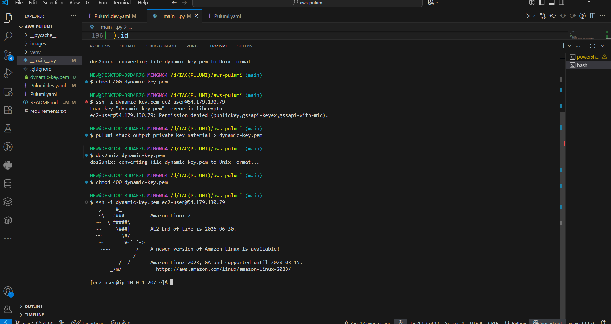

### **AWS Hands-On Exam (Pulumi)**


### Task 1 — Create a Secure VPC

This project uses **Pulumi** with **Python** to create a basic AWS networking setup, including:
- VPC
- Public and Private Subnets
- Internet Gateway (IGW)
- NAT Gateway
- Public and Private Route Tables


Task1: Create a Secure VPC

Task1:






### Task 2 — Bastion Host in Public Subnet

- EC2 in the public subnet with a public IPv4
- Security Group (bastion-sg): allow inbound TCP/22 only from your public IP.
- System hardening basics via User Data

Task2: Bastion Host in Public Subnet





### Task 3 — Private EC2 Instance

- EC2 in private subnet, SG (app-sg) must allow inbound SSH (22) only from bastion-sg (security group reference), not from the internet.

Task3: Private EC2 Instance


 


## 🛠️ **Prerequisites**
- [Python 3.8+](https://www.python.org/)
- [Pulumi CLI](https://www.pulumi.com/docs/get-started/install/)
- [AWS CLI](https://docs.aws.amazon.com/cli/latest/userguide/install-cliv2.html) (configured with credentials)
- An AWS account with permissions to create VPC, Subnets, NAT, and Routing.


## ⚙️ **Configuration**
Before running Pulumi, set your configuration values:

```bash
pulumi config set aws:region ap-southeast-1
pulumi config set vpcCidr 10.0.0.0/16
pulumi config set publicSubnetCidr 10.0.1.0/24
pulumi config set privateSubnetCidr 10.0.2.0/24
pulumi consfig set instanceType: "t2.micro"


